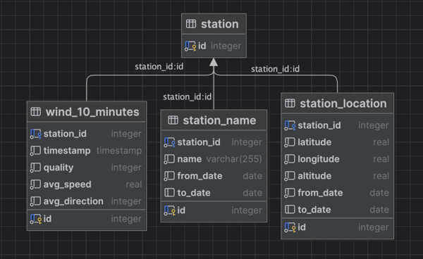

## DWD Info

10 Min Wind daten

https://opendata.dwd.de/climate_environment/CDC/observations_germany/climate/10_minutes/


# Einleitung

Die Wetterdaten der Wetterstation liegen als Dateien auf einem Share des DWD vor.
Dabei werden Daten wie Windgeschwindigkeit, Windrichtung etc. in einer Datei gespeichert.
Zudem werden Metainformationen vorenthalten, die in einer anderen Datei gespeichert sind.

In diesem Projekt sollen die Daten der Wetterstation in eine Datenbank geladen werden. Dazu muss zunächst ein Datenmodell erstellt werden, welches die Daten der Wetterstation abbildet.

Diese Daten sollen in einer Relationale Datenbank gespeichert werden und normalisiert sein.

## Installation

Um das Projekt zu installieren, muss zunächst das Repository geklont werden.

```bash
git clone
```

## Datenmodell

Das Datenmodell soll die folgenden Regeln der Normalisierung einhalten:

- 1. Normalform: Jede Spalte enthält nur atomare Werte.
- 2. Normalform: Jedes Nichtschlüsselattribut ist voll funktional abhängig vom Primärschlüssel.
- 3. Normalform: Es gibt keine transitiven Abhängigkeiten zwischen Nichtschlüsselattributen und dem Primärschlüssel.
- Boyce-Codd-Normalform: Jede Determinante ist ein Schlüsselkandidat.
- 4. Normalform: Es gibt keine mehrwertigen Abhängigkeiten.

Daraus ergibt sich das folgende ER Diagramm:




## Object Relation Mapping

Um die Daten in Python zugänglich zu machen, wird ein s.g.
Object Relation Mapping (ORM) verwendet. Dabei werden die Datenbanktabellen in Python Klassen abgebildet.
Um dies zu realisieren, wird die Bibliothek PeeWee verwendet.

Die Klassen werden im Modul `src.models` definiert.

## File Wrapper

Um die Daten aus den Dateien zu lesen, wurden verschiedene Wrapper implementiert.
Diese dienen dazu, die Logik, um die Daten aus den Dateien zu lessen
zu kapsel. Dabei gibt es zwei verschiedene Module. Im Modul
`src.file_wrapper.meta_data` werden Klassen zum Auslesen der Meta-Daten implementiert.
Im Modul `src.file_wrapper.weather_data` werden sind die Klassen für die Wetterdaten, in diesem Fall
der Windgeschwindigkeit hinterlegt.

